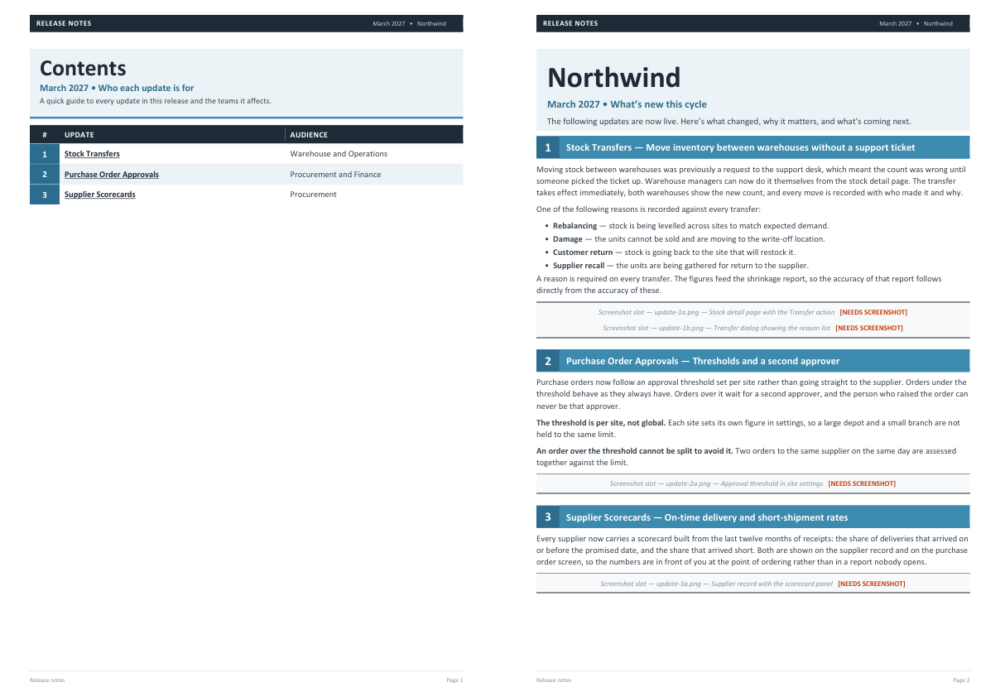
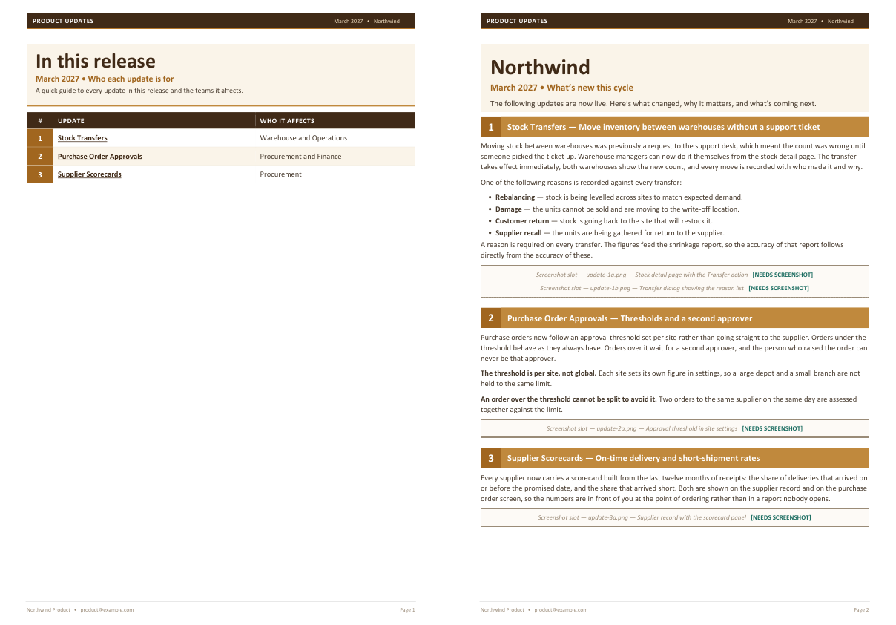

# docxforge

Build a designed Word document from JSON, and prove it matches the design.

Three small tools, no dependencies, standard library only:

| | |
|---|---|
| **`build`** | JSON in, `.docx` out — contents table with internal links, numbered section banners, images or labelled placeholders, a two-column card grid |
| **`inspect_docx`** | Read any `.docx` back: tables, cells, text boxes, real image sizes, fills, colours, font sizes, in layout order |
| **`diff`** | Compare two `.docx` files by what they say and how they look, not by bytes |



*Generated from [`examples/release.json`](examples/release.json). The product is fictional.*

## Why these three together

Generating a Word document is easy. Generating one that a designer will accept
is not — and the hard part is knowing whether you got it right.

The workflow these tools assume:

1. Take a document somebody has already designed and approved.
2. `inspect_docx` it, and write the colours, widths and type sizes into a brand file.
3. `build` the same content from JSON.
4. `diff` your output against the original. Iterate until the text matches exactly
   and the styling rows line up.

That last step is the point. **A regenerate-and-diff loop turns "does this look
right?" into a test you can run**, which is the difference between a document
generator you trust with something that goes to an audience and one you check by
eye every time.

## Install

Clone it. There is nothing to install.

```bash
git clone https://github.com/MHSBuilds/docxforge.git
cd docxforge
python -m unittest discover -s tests     # 21 tests, ~1s
```

Python 3.9+.

## Use

```bash
# a shell to build into — either from scratch...
python -m docxforge.blank --out brands/slate_template.docx --brand brands/slate.json

# ...or lifted out of a document you already have
python -m docxforge.template "Their_Release.docx" --out brands/theirs.docx

# build
python -m docxforge.build examples/release.json --out Release.docx

# same content, different brand
python -m docxforge.build examples/release.json --brand brands/amber.json --out Amber.docx

# read a document back
python -m docxforge.inspect_docx Release.docx

# compare two
python -m docxforge.diff reference.docx Release.docx
```

## Brand is data, not code

Nothing in `build.py` knows about any particular company. Colours, fixed
strings, column widths and display type sizes come from a brand file, and every
key is optional — leave one out and it falls back to the neutral default.

`brands/amber.json` overrides eighteen keys. Same content, same code:



A typo is reported rather than quietly ignored:

```
brand warning: unknown palette key "inkk"
brand warning: palette.green is not a 6-digit hex colour: 'not-a-colour'
```

A missing or corrupt brand file is a note, not an error — the build continues on
the defaults rather than failing at the moment you need the document.

Full reference: [BRAND.md](BRAND.md).

## It never invents anything

The content model has one rule that shapes everything else: **if the input does
not say it, the output does not claim it.**

- A missing value renders a visible `[NEEDS INPUT]` marker in the document body,
  not a plausible sentence.
- A missing image renders a labelled, dashed placeholder naming the slot and
  what it should show — never a silently smaller document.
- Everything missing is also listed in the build report, so it is visible whether
  you read the file or the terminal.

```
3 update(s), 5 Coming Soon item(s), contents table built.
0 of 4 screenshot slot(s) filled, 4 still empty.

Needs your input before sending:
  - 4 screenshot(s) (shot list below)
  - Update 3 does not record how ties are broken when two suppliers score identically

Shot list — drop these into the shots folder and re-run
  update-1a.png    Stock detail page with the Transfer action
  update-1b.png    Transfer dialog showing the reason list
```

## Images live outside the document

Images are referenced by slot name (`update-1a.png`) from a folder, never
embedded into your source of truth. That is what makes the document
**regenerated rather than patched**: fix a typo, re-run, and every image is
still in place. Paste one into the `.docx` by hand and the next build loses it.

Images are fitted to a box — 7.155 × 4.30 inches by default, aspect preserved,
never enlarged past their natural size unless a slot asks for it with
`width_in`. The height cap matters more than it looks: without it a portrait
screenshot renders eight inches tall and swallows a page.

## What it does not do

- **One layout.** Contents table, numbered banners, one-paragraph sections,
  image slots, card grid. Brand values are configurable; the structure is
  compiled in. It is a release-notes generator, not a general document DSL.
- **No text boxes, charts, footnotes or tracked changes.** `inspect_docx` reads
  text boxes; `build` does not write them.
- **No page-break control beyond `keepNext`.** Sections are held together with
  keep-next chains rather than explicit pagination, which is right for flowing
  content and wrong if you need precise page positions.
- **Word is not required to build**, but is the only thing that really validates
  the output. If you have it, render a PDF and look.

## Layout

```
docxforge/
  build.py          JSON -> .docx
  blank.py          generate a brand shell from scratch
  template.py       lift a brand shell out of an existing document
  inspect_docx.py   read a .docx back as a structure report
  diff.py           semantic diff of two .docx files
brands/
  slate.json        the neutral default
  amber.json        a partial second brand, to show fallback
examples/
  release.json      fictional demo content
tests/              21 tests, standard library only
```

- [BRAND.md](BRAND.md) — the brand file, key by key
- [DRAFT.md](DRAFT.md) — the content JSON, block by block

## Licence

MIT. See [LICENSE](LICENSE).
